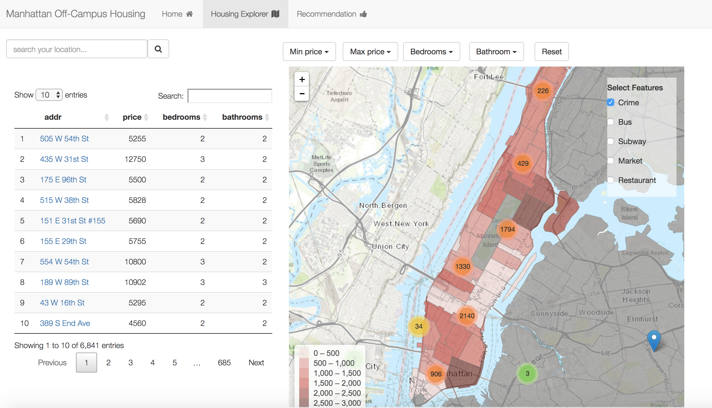
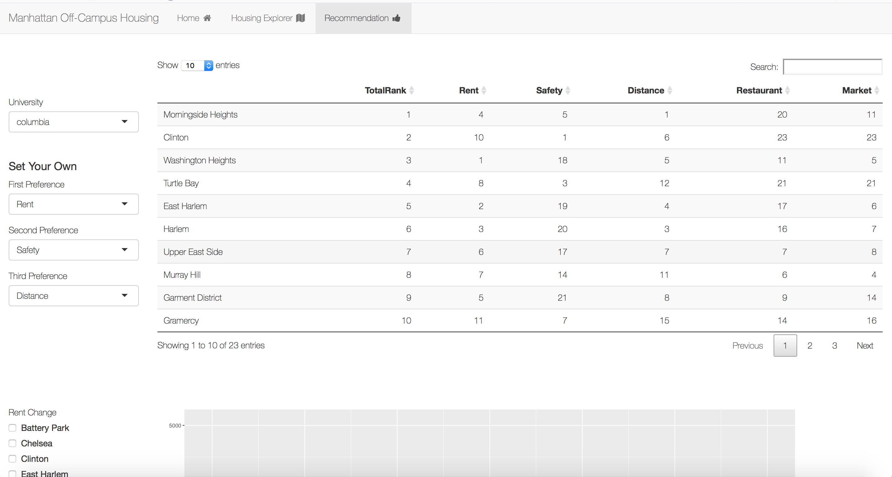

# Project 2: Open Data App - an RShiny app development project

### [Project Description](doc/project2_desc.md)







## Manhattan Off-Campus Housing
Term: Fall 2017

+ Team 6
+ **Manhattan Off-Campus Housing**: https://fall17grp6proj2.shinyapps.io/shinyrent1/
+ Team members
	+ Pinren Chen: pc2751@columbia.edu
	+ Lin Han: lh2810@columbia.edu
	+ Sihui Shao: ss5112@columbia.edu
	+ Chenyun Wu:cw2974@columbia.edu
	+ Xiaoyu Zhou: xz2599@columbia.edu

+ **Project summary**: In this project, we develop an app demo to intergrate off-campus housing options and various factors university students may concern about while seeking off-campus housing. App is divided into two main pages: Housing Explorer  and Recommendation. 

    Housing explorer tab shows rental house or apartment information in Manhattan area. Users have flexible search choices based on bedroom numbers, bathroom numbers and budget. To make search easier, the Tab also map out restaurant, transportation, market and safety condition nearby.

    Recommendation tab offers customed neighborhood recommendation for Columbia, NYU and Fordham University students. We offer five choices that students usually take into consideration while seeking off-campus housing. Users could choose top three preference among average rental price, safety, distance to school, market and restaurant. 
 
+ **Data Source**: We used data from data.gov, New York Open Data and Zillow. Also, we utilizd Zillow API, Google API and Nominatim API during data processing. For data sources detail, please kindly check data source [(description)](doc/DataSource.md).
    

+ **Contribution statement**: All team members contributed equally in all stages of this project. All team members approve our work presented in this GitHub repository including this contributions statement. 
   + Data acquisition: ss5112,pc2751
	 + searched and downloaded restaurant, crime, makret, bus stations, and subway stations from NYC open data and data.gov 
	 + online scraped housing data and used google map api to get geoinformation 
   + Data Cleaning:  xz2599, cw2974, ss5112, lh2810,  pc2751
	 + filtered out data within our analysis area 
   + Data Processing:  xz2599, cw2974, ss5112, lh2810,  pc2751
	 + mapped longitude and latitude into zip code and neighbourhood level using Google API and nominatim API in Python and R
	 + processed data/geojson data in R and saved as RData, based on analysis and visualization,
   + UI Design: cw2974,lh2810, pc2751
	 + used css, javascript for the layout and various front-end effect  
   + Server- Home page: cw2974,lh2810
	 + embedded gif and project title 
   + Server- Housing Explorer: xz2599, cw2974, ss5112, lh2810,  pc2751
   	 + mapped restaurant, makret, bus stations, subway stations and crime area on New York map
   	 + desgined and realized search and filter functions 
	 + realized rent information list based on filter and search 
	 + mapped rent appartments and house information on New York map with pop-up function
    + Server- Recommendation: xz2599, cw2974, ss5112, lh2810,  pc2751 
         + constructed a dynamic rank table 
         + ploted historical rent price at neighbourhood level
+ **Code Location**: Codes for data cleaning and data processing are under doc folder. Server and UI are under app folder.  

Following [suggestions](http://nicercode.github.io/blog/2013-04-05-projects/) by [RICH FITZJOHN](http://nicercode.github.io/about/#Team) (@richfitz). This folder is orgarnized as follows.

```
proj/
├── app/
├── lib/
├── data/
├── doc/
└── output/
```

Please see each subfolder for a README file.

